The Fireworks team has created a web-based fireworks application.
Fireworks is a longstanding CMS event display tool that interacts with
[MiniAOD](https://twiki.cern.ch/twiki/bin/view/CMS/MiniAOD){: target="_blank"}
files and allows the user to significantly customize the event display.
The following 5 \"explorations\" can be done offline by anyone
referencing this short exercise TWiki. *During the live exercise follow the prompts in the talk slides*{: style="color: #0000ff"}

## Introduction

Fireworks often requires (somewhat) cumbersome installation or heavy
network usage over X11 forwarding, which creates some hurdle in quickly
analyzing the events of interest. The FireworksWeb allows users to
circumvent all of the installation and simply use web to directly open
up a file such as `/store/.../some/miniaod.root` and directly start
analyzing the event.

Please take a look at the CMS Offline and Computing week [presentation](https://indico.cern.ch/event/1087821/){:. target="_blank"}
from Alja for overview of the project.

## Opening FireworksWeb

There are two instances of the website running currently.

- [http://fireworks.cern.ch](http://fireworks.cern.ch/){: target="_blank"}
- [http://fireworks.ucsd.edu/](http://fireworks.ucsd.edu/){: target="_blank"}

The main features are the same. The first is the more general use case
and accesses files stored on the CERN [EOS](https://twiki.cern.ch/twiki/bin/view/CMS/EOS) space. The latter can access files using XRootD redirector through Fermilab.

## Usage example

1. Go to the website
[http://fireworks.ucsd.edu/](http://fireworks.ucsd.edu/){: target="_blank"}.
You may be required to login through CERN SSO. You should see a webpage
like the following:
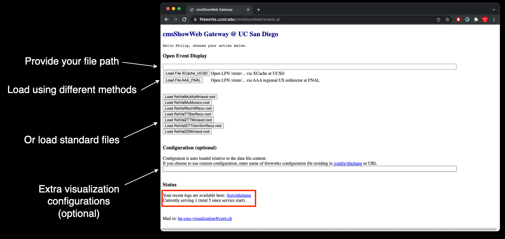{: width="70%"}

2. Open a file. Let's say we are working on an analysis and we are working with a ttbar nanoaod data set:

```
/TTTo2L2Nu_TuneCP5_13TeV-powheg-pythia8/RunIISummer20UL18NanoAODv9-106X_upgrade2018_realistic_v16_L1v1-v1/NANOAODSIM
```

Since fireworks can open only miniaod or higher, we have to find the parent data set first: (assuming one has set up the environment to have `dasgoclient` command available.)

```bash
$ dasgoclient -query "parent dataset=/TTTo2L2Nu_TuneCP5_13TeV-powheg-pythia8/RunIISummer20UL18NanoAODv9-106X_upgrade2018_realistic_v16_L1v1-v1/NANOAODSIM"

/TTTo2L2Nu_TuneCP5_13TeV-powheg-pythia8/RunIISummer20UL18MiniAODv2-106X_upgrade2018_realistic_v16_L1v1-v1/MINIAODSIM
```

Now let's get one file from it
```bash
$ dasgoclient -query "file dataset=/TTTo2L2Nu_TuneCP5_13TeV-powheg-pythia8/RunIISummer20UL18MiniAODv2-106X_upgrade2018_realistic_v16_L1v1-v1/MINIAODSIM"
/store/mc/RunIISummer20UL18MiniAODv2/TTTo2L2Nu_TuneCP5_13TeV-powheg-pythia8/MINIAODSIM/106X_upgrade2018_realistic_v16_L1v1-v1/30000/20747AAF-463B-C64F-A41D-8A896963C1E5.root
/store/mc/RunIISummer20UL18MiniAODv2/TTTo2L2Nu_TuneCP5_13TeV-powheg-pythia8/MINIAODSIM/106X_upgrade2018_realistic_v16_L1v1-v1/30000/D91C7ABA-3C38-9243-8B73-8D52ED19A994.root
/store/mc/RunIISummer20UL18MiniAODv2/TTTo2L2Nu_TuneCP5_13TeV-powheg-pythia8/MINIAODSIM/106X_upgrade2018_realistic_v16_L1v1-v1/30000/0A6C25F9-092F-764B-BF13-D1E577D15188.root
/store/mc/RunIISummer20UL18MiniAODv2/TTTo2L2Nu_TuneCP5_13TeV-powheg-pythia8/MINIAODSIM/106X_upgrade2018_realistic_v16_L1v1-v1/30000/233B1540-5AE7-904F-8890-DCA71CB688B4.root
...
...
```

From here we pick one file (e.g. first one)

```
/store/mc/RunIISummer20UL18MiniAODv2/TTTo2L2Nu_TuneCP5_13TeV-powheg-pythia8/MINIAODSIM/106X_upgrade2018_realistic_v16_L1v1-v1/30000/20747AAF-463B-C64F-A41D-8A896963C1E5.root
```

Then we put the path into the text box and click `Load File XCache_UCSD`

{: width="70%"}

Then the webpage will start printing out some status information and
after some time later once the file is loaded, the webpage will display
something like the following:

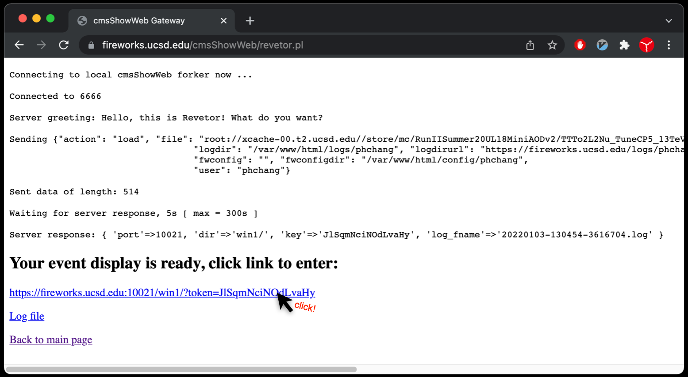{: width="70%"}

The webpage might redirect you straight to the event display, or you can
follow the link and you will see the fireworks open:

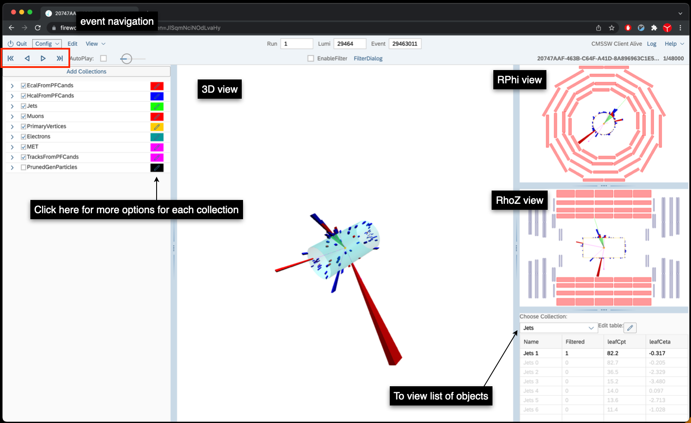{: width="70%"}

## Exploration 1: EW Physics

Open
[http://fireworks.cern.ch](http://fireworks.cern.ch/){: target="_blank"} and take a look at `/store/group/upgrade/visualization/dy.root`.

Once the path is provided click the
`Load File EOS` button. Once it opens you should something like the following:

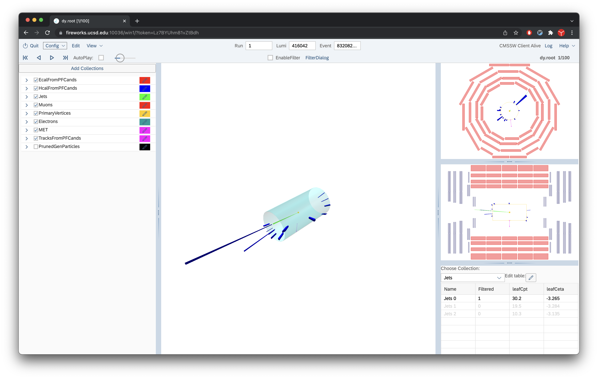{: width="70%"}

Before starting to play around, we can move to a more interesting event.
You can scan through the events by clicking the event navigation buttons
(right arrow), or enter the Run/Lumi/Event number directly. In this
exercise, each file has only one Run, you just need to edit the
lumi/event number to go to the new event.

Skip to the third event in the file, run/lumi/event is
1/416042/83208204.

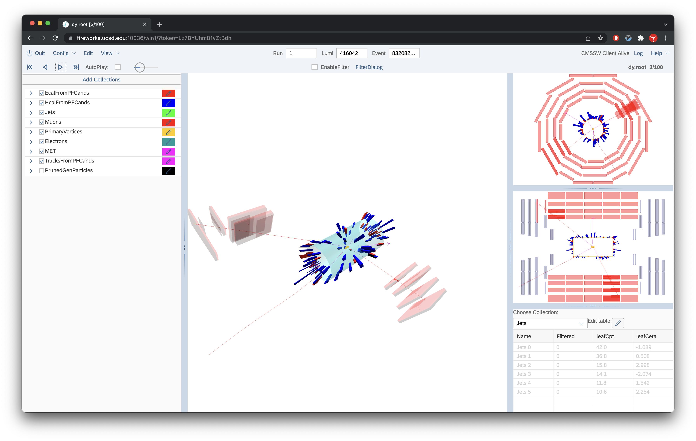{: width="70%"}

Try to click the interesting objects in the 3D view window and answer
the below question:

> ## Question 1
>  How many different kinds of objects are there? What are they?
{: .challenge }
Try to explore this event with different views with Fireworks. To swap
the \"main\" panel with other view, click on `View` at the top drop down
menu, then navigate to a view e.g. `RPhi` and click on `Switch Sides` to
make them go \"main\" view.

> ## Question 2
> Using the Table View on the bottom right, from the drop down menu below `Choose Collection:` choose Muons.
> How many additional Muons are not being displayed? (i.e. grayed out) Why
> are they hidden (Hint: press the \"pencil-shaed\" button in the left
> panel \"Muons\" section)?
>
>> ## Solution
>> In this configuration, the muon collection is filtered with expression "pt()>5 & isLooseMuon()",
>> meaning that each muon is only displayed if its pT is larger than 5 !GeV, and it passes the Loose ID requirements.
>> 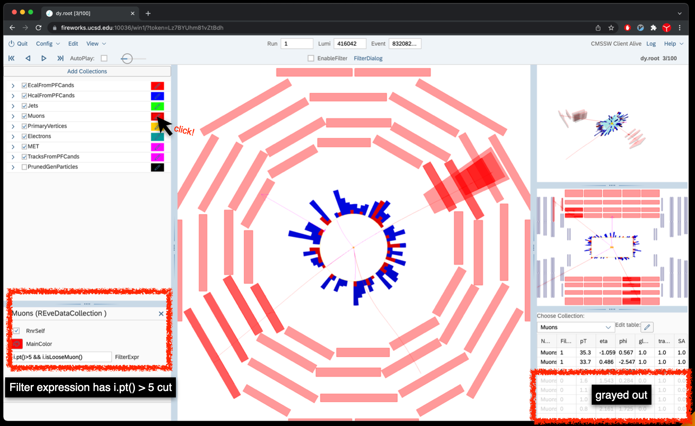{: width="70%"}
> {: .solution}
{: .challenge}


> ## Question 3
> Change the filter expression to
> display only muons with pT lower than 5 GeV (revert the change afterwards)
>> ## Solution
>> You should see this:
>> 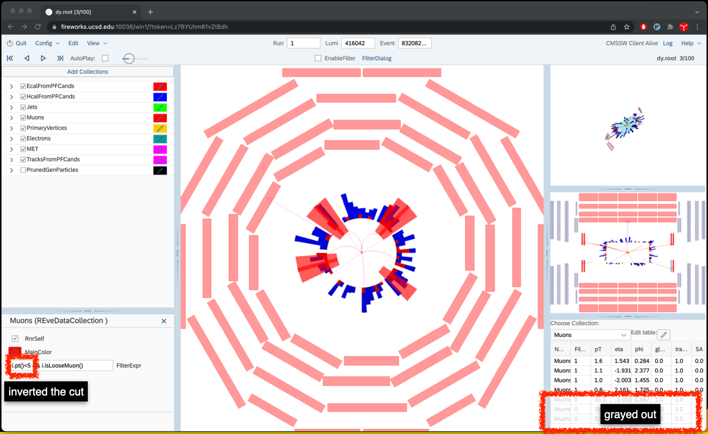{: width="70%"}
>{: .solution}
{: .challenge}

> ## Question 4
> Use the Table View in the bottom right corner to learn more details about the Muons collection. The table
> doesn\'t show dZ, to add it: go to the Muon collection, and click on the edit table button with a pencil icon; then in the expression text box,
> write `i.track()->dz()`, give a title \"dz\", and define precision \"3\"
> and click \"Add\". Why does the 5.9 GeV muon stand out? Could you have seen this by zooming in on the Rho-Z View?
>> ## Solution
>> You should see this:
>> 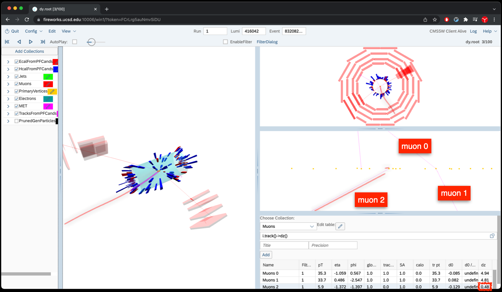{: width="70%"}
> {: .solution}
{: .challenge}

> ## Question 5
> Go to the 9th event in the file, run/lumi/event is 1/416042/83208226. What kind of event is it?
>
>> ## Solution
>>Z->ee event
> {: .solution}
{: .challenge}

> ## Question 6
> Uncheck the \"Electrons\" box to
>prevent them from being displayed: are there track pointing to both ECAL deposits?
>> ## Solution
>> Yes.
> {: .solution}
{: .challenge}

> ## Question 7
>  Go to the next event, the 10th event in the file, run/lumi/event is 1/416042/83208227. What kind of
> event is it? What is the MET in this event? What is the transverse mass (mT) of the muon+MET+jet? What about for the muon+MET+LeadingTrack? This
> is MC, so you can peak at the GenParticles to check your hypothesis. You will have to add pdgId to the column to get a better understanding of the event. From the Table view once the
> `PrunedGenParticles` is selected, edit the table to add \"i.pdgId()\" expression with \"pdgId\" title with precision of 0.
>
> NOTE: The legacy fireworks had kinematic variable calculator provided with the app. The feature is being worked on and will be added in the
> near future.
>> ## Show Answer
>> ```
>> MET is et = 46.6 !GeV, phi = -0.414
>> Muon has pt = 11.0 !GeV, eta = 1.292, phi = -0.580
>> Jet has pt = 39.6 !GeV, eta = 1.453, phi = 2.865
>> Track has pt = 32.6 !GeV,eta = 1.456, phi = 2.869
>>
>> mT(met, muon, jet) = 95.2 !GeV
>> mT(met, muon, track) = 86.4 !GeV
>>```
>> The event is likely a Z->tautau, with one tau decaying leptonically (muon + MET) and another in a one-prong hadronic tau decay. The one prong tau track is clustered in a jet with pT = 39.6 !GeV. When looking at the PrunedGenParticles list, one will find that there are pdgId 15 and -15 particle (grayed out) listed confirming that the event is indeed Z->tautau. The track pT is closest to the origina pion (pdgId=211) pT of 31.8 !GeV and also the eta.
>> 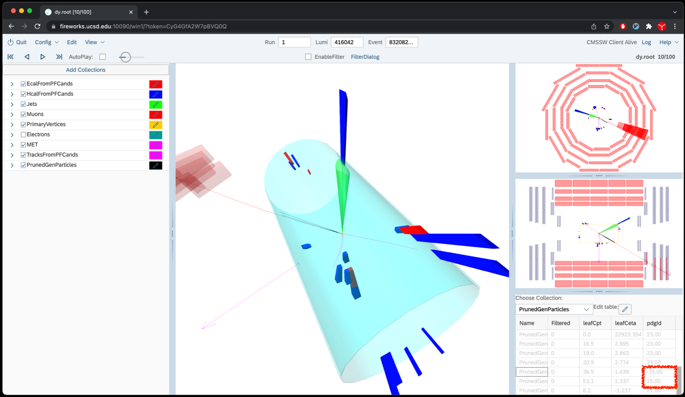{: width="70%"}
> {: .solution}
{: .challenge}


Now let us use event filter by clicking the event filter button called
`FilterDialog`. Search for events with large MET (i.e. \>60
GeV). Select only the MET filter to be `Active`. Then click `ApplyFilters` button.
Once the filter runs the `FilterStatus:` will report the number of events passing.
>##  Question 8
>  How many events are selected? Can you guess what is the cause?
>> ## Show Answer
>>
>>In total, six events are selected.
>>All are `Z-->TauTau` events except events 83208351, 8365, 8506.
>>Event 83208351 is a Z(ee)+jets event, the electrons are reconstructed properly (the invariant mass matches the Z). There is a below-threshold jet (pT=24.2 GeV) in the direction opposite to the MET, which could be mis-measured or coming from pile-up.
>>
>>Event 83208365 is a Z(mm)+jets event with one muon out of acceptance (pt = 45 GeV, eta = 2.4). The lost muon explains most of the MET, while the rest can be ascribed to jet mis-measurement.
>>
>>Event 83208506 is a Z(mm)+jets event with both muons out of acceptance and two very forward jets. Lost muons and mis-measured jets lead to the MET.
>>
>> 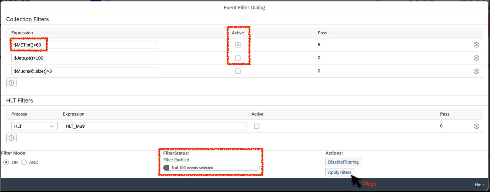{: width="70%"}
> {: .solution}
{: .challenge}


## Exploration 2: Top Physics

The LHC has a very large ttbar production cross section, it is often
called a top factory. Understanding ttbar events would be an important
task for standard model measurement or searches for new physics. Now let
us scan the ttbar file `/store/group/upgrade/visualization/ttjets.root`

Since events start to become complicated, a few hints before we start:

Hint 1: Top quarks decay into W+b, so you can look for b-tagged jets. To
do this, create a table for the jet collection and add the b-tag
discriminator method,
`i.bDiscriminator(\"pfCombinedInclusiveSecondaryVertexV2BJetTags\")`. A
\"medium\" b-tagging working point requires that the discriminator value
is larger than 0.8. Alternatively, add a new Jet collection (\"Add
Collection\") with a bDiscriminator filter applied.

 **NOTE: Please do not forget the escape character \"\\\"**.

> ## Show/Hide
> 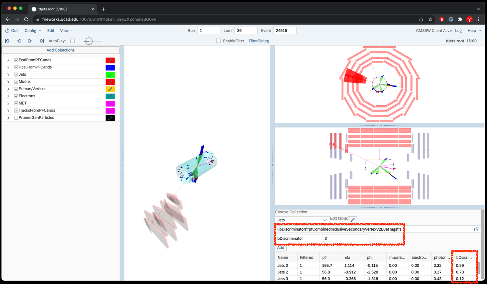{: width="70%"}
{: .solution}

**Hint 2 (MC only)**: use the PrunedGenParticles collection to make sense of the event: filter the collection with \"!isHardProcess\" to get the relevant particles (rather than the default filter).

First, go to the first event, 36/24518.

> ## Question 9
>  What is this event? Can you find the combination of jets from Ws and from tops?
> > ## Show/Hide
> >This is a particularly difficult ttbar event, with one W decaying to leptons (muon+neutrino), and other to hadrons.
>>
>> The transverse mass (mT) of the muon+MET is 98 GeV, very high for a W, presumably due to MET resolution.
>> To make things worse, one of the quarks from the hadronic W is very low pT and does not form a jet.
>> 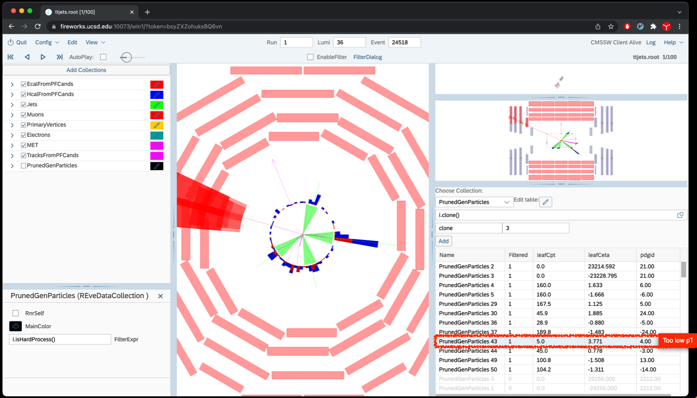{: width="70%"}
> {: .solution}
{: .challenge}


Next, let\'s see event 2744/1876862
> ## Question 10
>  What are the objects in the event? Are the muons close to jets?
> > ## Show Answer
> > This is a nice dilepton (e+mu) ttbar event. There are three muons, but two of them are close to jets. Looking at the
>>truth record, we confirm that those two jets are coming from the b quarks. The truth record says that there are following two b-quarks:
>>
>>```
>>pt = 87.4 !GeV, eta = -0.49, phi = 2.39,
>>pt = 52.6 !GeV, eta = 1.96, phi = 1.71
>>
>>While the two jets are
>>pt = 66.5 !GeV, eta = -0.721, phi = 2.287
>>pt = 38.4 !GeV, eta = 2.012, phi = 1.622
>>```
>>The eta / phi directions show good agreement indicating that these indeed are the b-jets.
>> 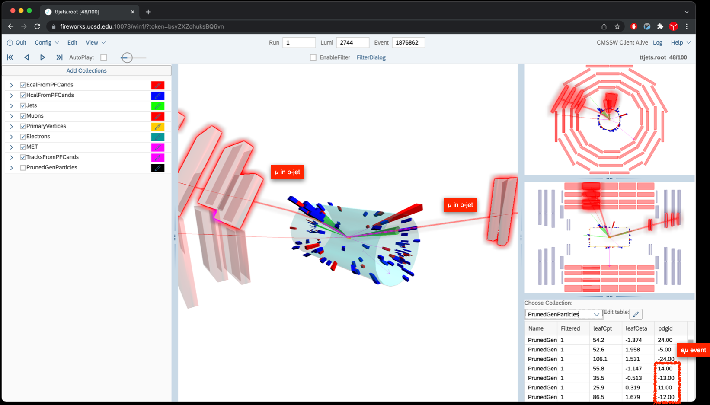{: width="70%"}
>{: .solution}
{: .challenge}

## Exploration 3: Higgs Physics

Now let us scan the Higgs file
`/store/group/upgrade/visualization/ggh4l.root`

First go to event 1278/254045.

> ## Question 11
>  How many leptons in this event? What is this event? Can you calculate the invariant mass of the higgs? Are both Zs on-shell and
> if not which is the off-shell one?
> > ## Show/Hide
> > This event is `H->ZZ->2e2mu`. Invariant mass of the Higgs is 125.9 GeV, the off-shell Z is the one from the muon pair with mass 27.6 GeV (electrons make >> an invariant mass of 92.4 GeV)
> {: .solution}
{: .challenge}


------------------------------------------------------------

Go to event 1278/254054.

Use the muon table view to get the right charges. (i.e. add a column
with `i.track()->charge()` or `i.charge()`) Let\'s add isolation column.
The more proper PF-based isolation is currently not accessible. So we
will use what is available. Add a column with
`(i.caloIso()+i.trackIso())/i.pt()`. Once you do that you\'ll see
something like this:

Result of adding charge and isolation
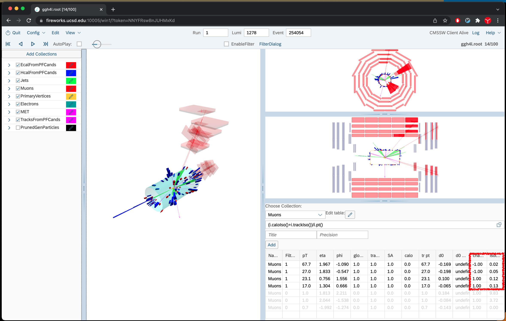{: width="70%"}

Also for isolation
`(i.userIsolation(\"PfChargedHadronIso\")+i.userIsolation(\"PfNeutralHadronIso\")+i.userIsolation(\"PfGammaIso\"))/i.pt()`
can be used as well.
> ## Question 12
>  What is this event? Can you pair the muons and get the invariant mass of the two Zs? Are all 4 muons isolated (Isolation\<0.2)?
> > ## Show/Hide
> > It is `H->ZZ->4mu`. Invariant mass of the Higgs is 126.9 GeV. From the table you can see the charge of the muons and try the combinations with
> > opposite charges. Turns out that muons 0 and 2 are from an on-shell Z with mass 92.1 GeV, muons 1 and 4 from an off-shell Z with mass 27.0 GeV. All of the muons are isolated.
> {: .solution}
{: .challenge}
-----------------------------------------------------

Go to event 1278/254110.
> ## Question 14
>  What is this event? Are the electrons isolated? Can you pair electrons in the correct way? Why is
> the 4th electron not drawn?
>
> Hint: Isolation can be accessed via
> `(i.userIsolation(\"PfChargedHadronIso\")+i.userIsolation(\"PfNeutralHadronIso\")+i.userIsolation(\"PfGammaIso\"))/i.pt()`
>
>> ## Show Answer
>> It is H->ZZ->4e. Invariant mass of the Higgs is 121 GeV. All electrons are fairly isolated, i.e. below 20%, except 1. From the electron table you can see the
>> charge of the electrons and try the combinations with opposite charges. Based on the truth information the first and third electrons are the correct pair, and the 2nd and 4th, each with 23.5 !GeV and 61.9 !GeV respectively.
> {: .solution}
{: .challenge}

## Exploration 4: 13TeV collision events

In this section, we will look at collision events at 13TeV. These events
are selected from SingleElectron and SingleMuon datasets. The events
with two or more leptons are selected.

There are a few relevant files. Open the single electron data file,
`/eos/uscms/store/user/cmsdas/2020/short_exercises/Visualization/data_SingleElectron.root`

Go to event 274200:48:72793234
> ## Question 15
> What kind of event is this? How can you justify your answer?
>
>> ## Show/Hide
>> This is a probably a Z->ee event, as can be understood from the invariant mass of the two electrons (90.647 GeV).
>> 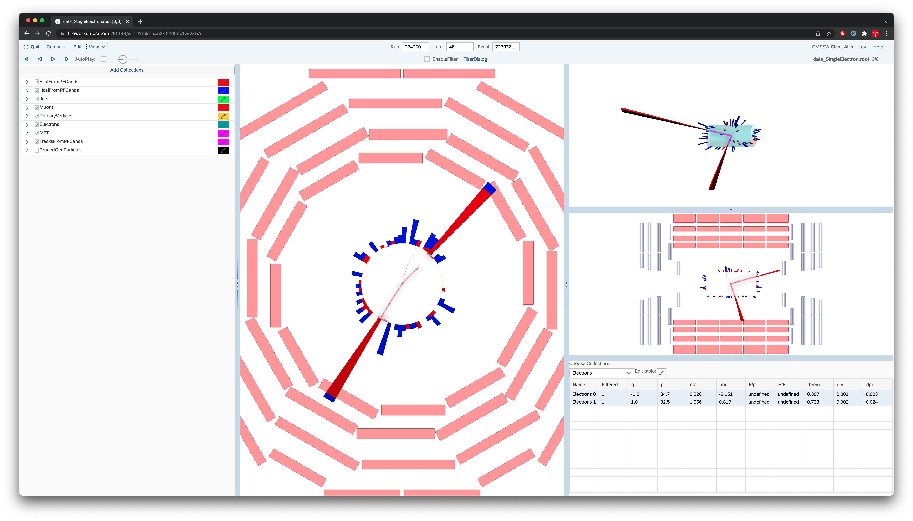{: width="70%"}
>{: .solution}
{: .challenge}

---

Go to event 274200:48:71915470
> ## Question 16
>  What kind of event is this? How can you justify your answer?
>> ## Show Answer
>> The invariant mass of the two electrons (84.667 GeV) and that of the two jets (104.962 GeV).
>> This could even be a ZZ->2e2q event, although this process is extremely rare with respect to the more frequent Z+2jets.
>> 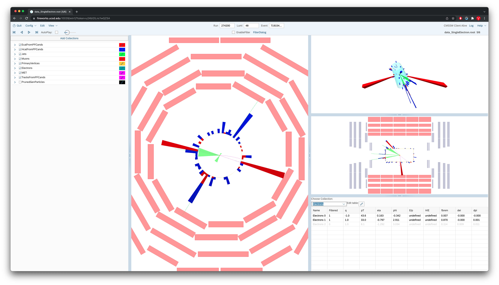{: width="70%"}
> {: .solution}
{: .challenge}
---------------

Go to event 274200:48:72636084
> ## Question 17
>  What kind of event is this? How can you justify your answer?
>> ## Show Answer
>> This is probably a Z+jet event, as can be understood from the invariant mass of the two isolated electrons (90.312 GeV).
>>
>> Hint: Isolation can be accessed via `(i.userIsolation(\"PfChargedHadronIso\")+i.userIsolation(\"PfNeutralHadronIso\")+i.userIsolation(\"PfGammaIso\"))/i.pt()`
>> The 2nd electron with very high isolation value is likely part of a quark or gluon (i.e. ISR).
>> 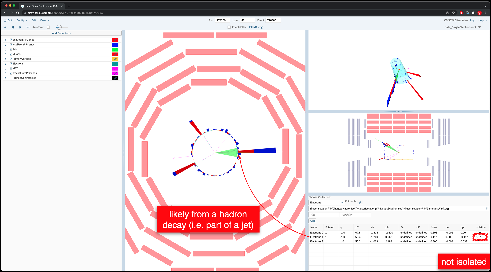{: width="70%"}
> {: .solution}
{: .challenge}

Often we find events that are not trivial to interpret, and usually
there are at least a couple of processes which could have generated the
event. If you got this far in the exercise you have enough experience to
look at some more difficult events and try to guess what they come from.
Typical questions to address are: how many AK4 jets are there in this
event? Are they all isolated from leptons? Are they b-jets? Are there
any electrons in the event with pt\>30GeV? If so, check their isolation.
Are there any muons in the event with pt\>30GeV? If so, check their
isolation. Is this a single lepton event? If so, what is the lepton? Can
you identify any likely top candidates?
> ## Question 18/19
> Look at some interesting events in this dataset and try to interpret them: 1023/1523919869, 1023/1523757530.
{: .challenge}

You can also explore the single muon data file
`/eos/uscms/store/user/cmsdas/2020/short_exercises/Visualization/data_SingleMuon.root`

You can go through the events and characterize each based on the objects you find.

If you have time at the end (after the next section), explore the events stored in

`/eos/uscms/store/user/cmsdas/2020/short_exercises/Visualization/SinglePhoton*.root`, and see if you can find anything interesting.

## Exploration 5: Scanning noisy events

In this section, we will have a look at a few events one does not want
to end up with after having applied an analysis selection. These events
can be of different natures:

-   Cosmics: muons created in the interaction process of cosmic
    radiation with the earth atmosphere can reach the CMS detector and
    leave a signal in the muon systems and even in the calorimeters.
    Those events can be identified due to their peculiar signature: a
    series of hits in the muon chambers (mostly DTs and RPCs) forming a
    straight line. This line can also be aligned with an energy deposit
    in the calorimeters.
-   Beam halo: the protons of the LHC beams can scatter off elements
    inside the pipe. These interactions can create muons travelling
    alongside the beam that can leave signals in the detector. Again,
    those events have quite a striking signature: a series of CSCs hits
    aligned in phi (i.e. aligned with the beam axis) and one or several
    calorimeter towers located at the same azimuthal angle.
-   Reconstruction issues: unlike the two previous sources of undesired
    events, this is not an instrumental issue but a software matter. It
    can happen that the particle flow algorithm (responsible for the
    global reconstruction process) assigns huge momentum to particles,
    due to a mismatch between the tracks and the calorimeter deposits or
    muon chambers hits. The error can also be very large but the
    algorithm keeps it in the reconstruction loop somehow. Those events
    lead to fake very high energy particles and therefore high missing
    transverse energy.

Let\'s now have a look at some of those events:

Go to event 274316:385:698231955 of
`/store/group/upgrade/visualization/BadEvents_Run2016B1.root`

> ## Question 22
> What is this event?
>
> **Hint**
>
> Take a look at the CSC-segments. Due to white background, the CSC view is a bit hard to catch. Change the color to see it a little better.
> If one hovers the mouse one can see click on them to highlight to make it more visible. Also, Ctrl- click will allow user to click multiple at a time.
>> ## Show/Hide
>>  Beam halo – On the Rho-Z view, you observe a series of CSC hits forming a straight line. You can also notice that the HCAL deposit actually consists of several HCAL towers. If you now go to the 3D view, you can see that the HCAL
>> towers lie on the same phi coordinate as the CSC hits. To get even more convinced of the phi correspondence of the calorimeter hits, you can also use the Lego view and zoom on to the area of interest.
>> 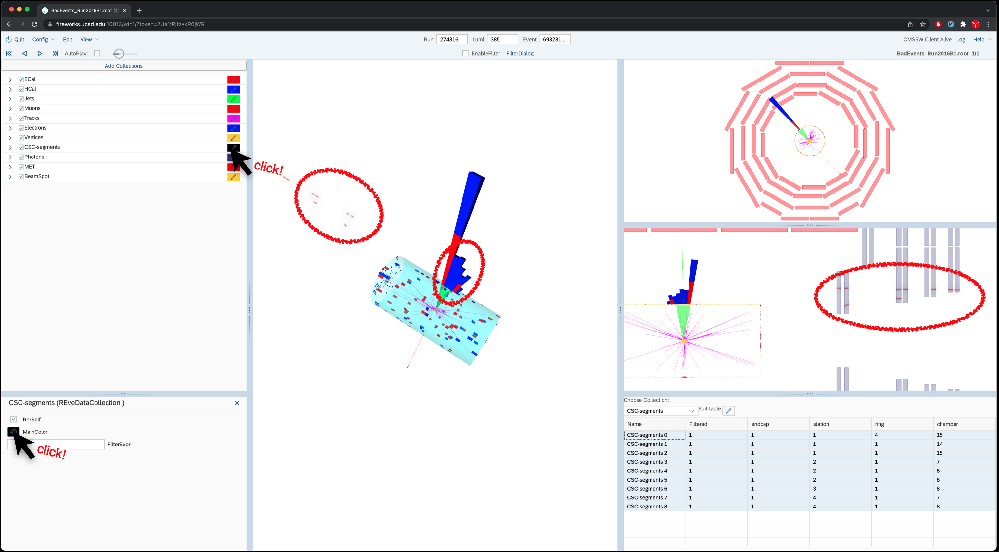{: width="70%"}
> {: .solution}
{: .challenge}
---

Go to event 275074:259:417685155 of
`/store/group/upgrade/visualization/BadEvents_Run2016B2.root`

> ## Question 23
>  What is this event?
>> ## Show Answer
>> Beam halo -- This is again a beam halo event. In this case, you actually have CSC hits on both sides of the detector (forward and backward).
>> 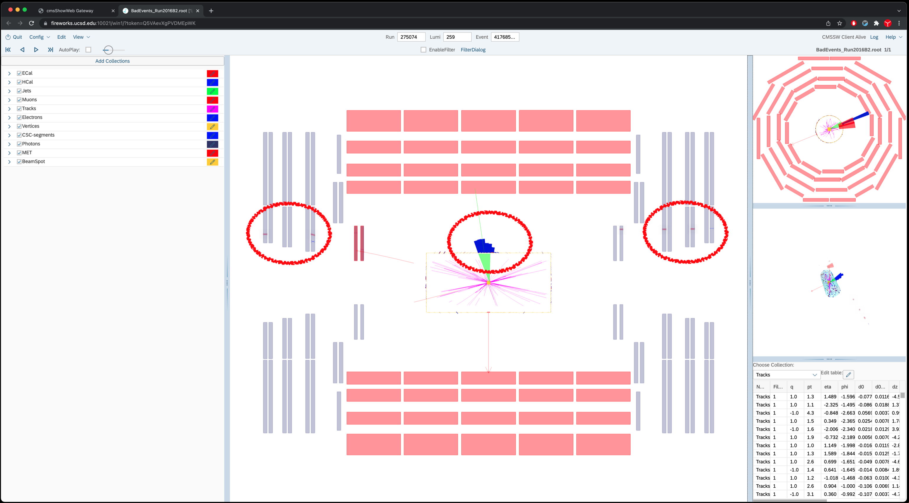{: width="70%"}
> {: .solution}
{: .challenge}

------------------------------------------------------------------------

Go to event 276244:428:658649950 of
`/store/group/upgrade/visualization/BadEvents_Run2016C1.root`

{width="16"
height="16" border="0"}[ Question 24 - What is this event?
]{style="color: #ff0000"}

Hint: The DT-Segments are not available in FireworksWeb for now. (Will
be supported in the future.) So this one will be more easier with Legacy
Fireworks. However, try adding collections (Click Add Collections -\>
Search \"cosmic\" -\> Select \"Muons\", \"muonsFromCosmics\" -\>
[[AddCollection](https://twiki.cern.ch/twiki/bin/edit/CMS/AddCollection?topicparent=CMS.SWGuideCMSDataAnalysisSchoolLPC2024VisualizationExercise;nowysiwyg=0 "this topic does not yet exist; you can create it."){rel="nofollow"}]{.twikiNewLink}).

::: {.twistyPlugin .twikiMakeVisibleInline}
[[{border="0"}[Show
result\...]{.twikiLinkLabel
.twikiUnvisited}](https://twiki.cern.ch/twiki/bin/viewauth/CMS/SWGuideCMSDataAnalysisSchoolLPC2024VisualizationExercise#)
]{#twistyIdCMSSWGuideCMSDataAnalysisSchoolLPC2024VisualizationExercise21show
.twistyRememberSetting .twistyTrigger .twikiUnvisited .twistyInited}
[[{border="0"}[Hide
result\...]{.twikiLinkLabel
.twikiUnvisited}](https://twiki.cern.ch/twiki/bin/viewauth/CMS/SWGuideCMSDataAnalysisSchoolLPC2024VisualizationExercise#)
]{#twistyIdCMSSWGuideCMSDataAnalysisSchoolLPC2024VisualizationExercise21hide
.twistyRememberSetting .twistyTrigger .twikiUnvisited .twistyHidden
.twistyInited}
:::

::: twistyPlugin
::: {#twistyIdCMSSWGuideCMSDataAnalysisSchoolLPC2024VisualizationExercise21toggle .twistyRememberSetting .twistyContent .twistyInited .twistyHidden}
``` command
Cosmics – Looking at the Rho-Phi view, you see that some of the DT hits are
forming a straight line. This can also be seen from the Rho-Z view. Going to
the 3D view and playing a bit with the point of view, you can observe that the
DT line coincides with the ECAL deposits. This is a muon hitting ECAL
electronics to create a fake high energy ECAL deposit with no track: a photon
(as can be seen from the photon collection).
!FireworksWeb with cosmic muon collection:

Legacy Fireworks screenshot:
```
:::
:::

------------------------------------------------------------------------

Go to event 276437:1940:3426602195 of
`/store/group/upgrade/visualization/BadEvents_Run2016D1.root`

{width="16"
height="16" border="0"}[ Question 25 - What is this event?
]{style="color: #ff0000"}

::: {.twistyPlugin .twikiMakeVisibleInline}
[[{border="0"}[Show
result\...]{.twikiLinkLabel
.twikiUnvisited}](https://twiki.cern.ch/twiki/bin/viewauth/CMS/SWGuideCMSDataAnalysisSchoolLPC2024VisualizationExercise#)
]{#twistyIdCMSSWGuideCMSDataAnalysisSchoolLPC2024VisualizationExercise22show
.twistyRememberSetting .twistyTrigger .twikiUnvisited .twistyInited}
[[{border="0"}[Hide
result\...]{.twikiLinkLabel
.twikiUnvisited}](https://twiki.cern.ch/twiki/bin/viewauth/CMS/SWGuideCMSDataAnalysisSchoolLPC2024VisualizationExercise#)
]{#twistyIdCMSSWGuideCMSDataAnalysisSchoolLPC2024VisualizationExercise22hide
.twistyRememberSetting .twistyTrigger .twikiUnvisited .twistyHidden
.twistyInited}
:::

::: twistyPlugin
::: {#twistyIdCMSSWGuideCMSDataAnalysisSchoolLPC2024VisualizationExercise22toggle .twistyRememberSetting .twistyContent .twistyInited .twistyHidden}
``` command
Cosmics – The justification is the same as for the previous event. The straight
DT line is quite obvious here. Notice that Fireworks tries to draw tracks
coming from the center: it always assumes particles come from the center of the
detector.
```
:::
:::

------------------------------------------------------------------------

Go to event 276544:83:153985051 of
`/store/group/upgrade/visualization/BadEvents_Run2016D2.root`

{width="16"
height="16" border="0"}[ Question 26 - What is this event?
]{style="color: #ff0000"}

::: {.twistyPlugin .twikiMakeVisibleInline}
[[{border="0"}[Show
result\...]{.twikiLinkLabel
.twikiUnvisited}](https://twiki.cern.ch/twiki/bin/viewauth/CMS/SWGuideCMSDataAnalysisSchoolLPC2024VisualizationExercise#)
]{#twistyIdCMSSWGuideCMSDataAnalysisSchoolLPC2024VisualizationExercise23show
.twistyRememberSetting .twistyTrigger .twikiUnvisited .twistyInited}
[[{border="0"}[Hide
result\...]{.twikiLinkLabel
.twikiUnvisited}](https://twiki.cern.ch/twiki/bin/viewauth/CMS/SWGuideCMSDataAnalysisSchoolLPC2024VisualizationExercise#)
]{#twistyIdCMSSWGuideCMSDataAnalysisSchoolLPC2024VisualizationExercise23hide
.twistyRememberSetting .twistyTrigger .twikiUnvisited .twistyHidden
.twistyInited}
:::

::: twistyPlugin
::: {#twistyIdCMSSWGuideCMSDataAnalysisSchoolLPC2024VisualizationExercise23toggle .twistyRememberSetting .twistyContent .twistyInited .twistyHidden}
Beam halo -- Another halo event.
:::
:::

------------------------------------------------------------------------

Go to event 276585:73:117748568 of
`/store/group/upgrade/visualization/BadEvents_Run2016D3.root`

{width="16"
height="16" border="0"}[ Question 27 - What is this event?
]{style="color: #ff0000"}

::: {.twistyPlugin .twikiMakeVisibleInline}
[[{border="0"}[Show
result\...]{.twikiLinkLabel
.twikiUnvisited}](https://twiki.cern.ch/twiki/bin/viewauth/CMS/SWGuideCMSDataAnalysisSchoolLPC2024VisualizationExercise#)
]{#twistyIdCMSSWGuideCMSDataAnalysisSchoolLPC2024VisualizationExercise24show
.twistyRememberSetting .twistyTrigger .twikiUnvisited .twistyInited}
[[{border="0"}[Hide
result\...]{.twikiLinkLabel
.twikiUnvisited}](https://twiki.cern.ch/twiki/bin/viewauth/CMS/SWGuideCMSDataAnalysisSchoolLPC2024VisualizationExercise#)
]{#twistyIdCMSSWGuideCMSDataAnalysisSchoolLPC2024VisualizationExercise24hide
.twistyRememberSetting .twistyTrigger .twikiUnvisited .twistyHidden
.twistyInited}
:::

::: twistyPlugin
::: {#twistyIdCMSSWGuideCMSDataAnalysisSchoolLPC2024VisualizationExercise24toggle .twistyRememberSetting .twistyContent .twistyInited .twistyHidden}
Cosmics -- Another cosmics event.
:::
:::

------------------------------------------------------------------------

Go to event 276811:2460:3888980376 of
`/store/group/upgrade/visualization/BadEvents_Run2016D4.root`

{width="16"
height="16" border="0"}[ Question 28 - What is this event?
]{style="color: #ff0000"}

::: {.twistyPlugin .twikiMakeVisibleInline}
[[{border="0"}[Show
result\...]{.twikiLinkLabel
.twikiUnvisited}](https://twiki.cern.ch/twiki/bin/viewauth/CMS/SWGuideCMSDataAnalysisSchoolLPC2024VisualizationExercise#)
]{#twistyIdCMSSWGuideCMSDataAnalysisSchoolLPC2024VisualizationExercise25show
.twistyRememberSetting .twistyTrigger .twikiUnvisited .twistyInited}
[[{border="0"}[Hide
result\...]{.twikiLinkLabel
.twikiUnvisited}](https://twiki.cern.ch/twiki/bin/viewauth/CMS/SWGuideCMSDataAnalysisSchoolLPC2024VisualizationExercise#)
]{#twistyIdCMSSWGuideCMSDataAnalysisSchoolLPC2024VisualizationExercise25hide
.twistyRememberSetting .twistyTrigger .twikiUnvisited .twistyHidden
.twistyInited}
:::

::: twistyPlugin
::: {#twistyIdCMSSWGuideCMSDataAnalysisSchoolLPC2024VisualizationExercise25toggle .twistyRememberSetting .twistyContent .twistyInited .twistyHidden}
Cosmics -- Another cosmics event.
:::
:::

------------------------------------------------------------------------

Go to event 276582:638:1144780530 of
`/store/group/upgrade/visualization/BadEvents_Run2016D5_AOD.root`

The fwc file defines all the parameter of the Fireworks display: the
colors, the tables and views, the collections shown, etc. You can always
change the parameters while looking at an event and then save your
configuration in "File→Save Configuration".

{width="16"
height="16" border="0"}[ Question 29 - Let\'s now have a look at this
event. Can you spot any peculiar feature? ]{style="color: #ff0000"}

::: {.twistyPlugin .twikiMakeVisibleInline}
[[{border="0"}[Hint\...]{.twikiLinkLabel
.twikiUnvisited}](https://twiki.cern.ch/twiki/bin/viewauth/CMS/SWGuideCMSDataAnalysisSchoolLPC2024VisualizationExercise#)
]{#twistyIdCMSSWGuideCMSDataAnalysisSchoolLPC2024VisualizationExercise26show
.twistyRememberSetting .twistyTrigger .twikiUnvisited .twistyInited}
[[{border="0"}[Hide
result\...]{.twikiLinkLabel
.twikiUnvisited}](https://twiki.cern.ch/twiki/bin/viewauth/CMS/SWGuideCMSDataAnalysisSchoolLPC2024VisualizationExercise#)
]{#twistyIdCMSSWGuideCMSDataAnalysisSchoolLPC2024VisualizationExercise26hide
.twistyRememberSetting .twistyTrigger .twikiUnvisited .twistyHidden
.twistyInited}
:::

::: twistyPlugin
::: {#twistyIdCMSSWGuideCMSDataAnalysisSchoolLPC2024VisualizationExercise26toggle .twistyRememberSetting .twistyContent .twistyInited .twistyHidden}
Look at the "Muons" table.
:::
:::

::: {.twistyPlugin .twikiMakeVisibleInline}
[[{border="0"}[Show
result\...]{.twikiLinkLabel
.twikiUnvisited}](https://twiki.cern.ch/twiki/bin/viewauth/CMS/SWGuideCMSDataAnalysisSchoolLPC2024VisualizationExercise#)
]{#twistyIdCMSSWGuideCMSDataAnalysisSchoolLPC2024VisualizationExercise27show
.twistyRememberSetting .twistyTrigger .twikiUnvisited .twistyInited}
[[{border="0"}[Hide
result\...]{.twikiLinkLabel
.twikiUnvisited}](https://twiki.cern.ch/twiki/bin/viewauth/CMS/SWGuideCMSDataAnalysisSchoolLPC2024VisualizationExercise#)
]{#twistyIdCMSSWGuideCMSDataAnalysisSchoolLPC2024VisualizationExercise27hide
.twistyRememberSetting .twistyTrigger .twikiUnvisited .twistyHidden
.twistyInited}
:::

::: twistyPlugin
::: {#twistyIdCMSSWGuideCMSDataAnalysisSchoolLPC2024VisualizationExercise27toggle .twistyRememberSetting .twistyContent .twistyInited .twistyHidden}
What balances the large MET of 1.9
[TeV](https://twiki.cern.ch/twiki/bin/view/CMS/TeV) is the
Jets 0, which is made by a single charged hadron track. (i.e. single
track line + single hcal/ecal tower).\
On the other hand, you notice that a muon (Muon_0) passes right at the
same place.\
This muon has an insanely large track pT error (much larger than the
track pT itself which is already at 2
[TeV](https://twiki.cern.ch/twiki/bin/view/CMS/TeV)),\
and is not identified by the particle flow algorithm as a muon.\
Instead, its inner track is associated with the fake charged hadron we
just described above.\
This makes up a fake event where a charged hadron balances large MET.\
Those are reconstruction issues that happen from time to time and that
must be filtered out in order to keep the tail of the MET spectrum
clean.
:::
:::
